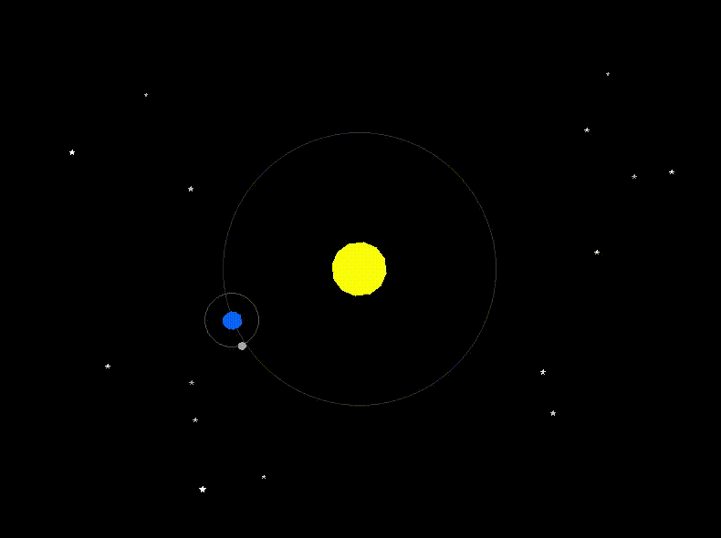
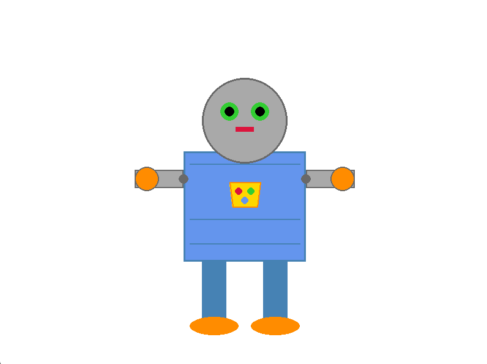

# 🐍 Projetos em Python com Pygame

Este repositório reúne pequenos projetos desenvolvidos em Python utilizando a biblioteca **Pygame**.
Os objetivos principais são: praticar programação gráfica, algoritmos e animações.

## 📂 Projetos incluídos

* **Sistema Solar (`Solar System.py`)**
  Animação interativa representando Sol, Terra, Lua e estrelas com transformações geométricas.

  

* **Algoritmo de Bresenham (`Bresenham's Algorithm.py`)**
  Implementação interativa do algoritmo de Bresenham para desenhar linhas no plano.

  

* **Robô (`Robot.py`)**
  Desenho de um robô estilizado utilizando formas geométricas.

  

## 🛠️ Instalação

1. **Clonar este repositório**

```bash
git clone https://github.com/Matheuz233/Pygame-Projects.git
cd Pygame-Projects
```

2. **Criar um ambiente virtual (opcional, mas recomendado)**

```bash
python -m venv venv
source venv/bin/activate   # Linux/Mac
venv\Scripts\activate      # Windows
```

3. **Instalar dependências**

Os projetos utilizam apenas **Pygame** como dependência externa:

```bash
pip install pygame
```

Se quiser registrar num arquivo de requisitos:

```bash
pip install -r requirements.txt
```

*(Crie um arquivo `requirements.txt` contendo `pygame`.)*

## ▶️ Como executar

Cada projeto pode ser executado individualmente:

```bash
python Solar\ System.py
python Bresenham's\ Algorithm.py
python Robot.py
```
